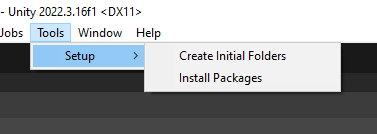
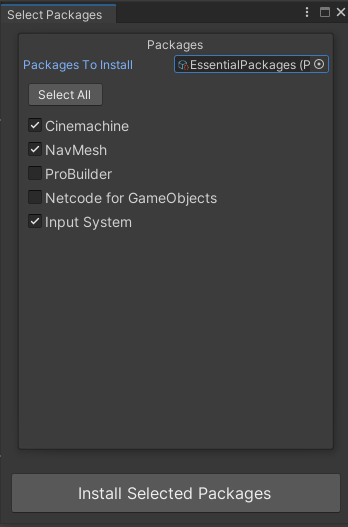
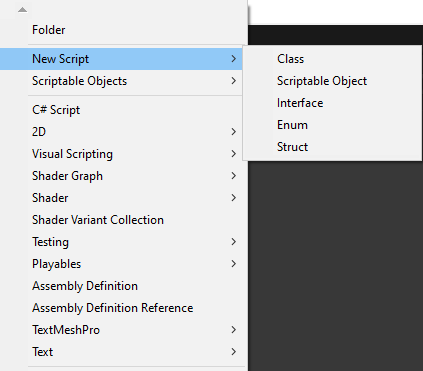
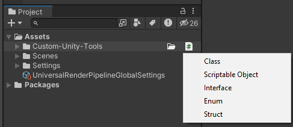

# Custom Tools Package

## Overview

The Custom Tools Package for Unity provides a set of useful functionalities to streamline your project development workflow. It includes tools for initializing project folders, installing packages, creating script templates, enhancing the project window, and providing convenient shortcuts for common actions.

## Features

### 1. Custom Attributes

- Required Attribute: shows in the editor if there's a missing field. currently works on References and strings.

- Button Attribute: Can be added to Methods and run them either in playmode or at any time. Works with Coroutines and any method with/without parameters

### 2. Initialize Project Folders

- Create essential project directories such as Animations, Models, Scripts, and more.
  
  **Usage:**
  - Select "Tools > Setup > Create Initial Folders."

### 3. Package Installation

- Download and install packages listed in a ScriptableObject (`PackagesToInstallSO`).
- Utilize a custom window to easily select and install desired packages.

  **Usage:**
  - Create your own PackagesToIntallSO or use the one provided in the package **(might be hidden)**.
  - Select "Tools > Setup > Install Packages."
  - Insert the ScriptableObject
  - Select the packages you want or Select All packages.
  - Click Install

### 4. Script Creator

- Add script templates for common types: MonoBehaviour, ScriptableObject, Interface, Enum, Struct.
- Access these templates conveniently through the "Assets/Create/New Script" menu.

### 5. Project Window Highlight

- Highlight the file where the mouse is hovering in the Project window.

### 6. Project Window Icons

- When hovering over a folder in the Project window, two icons appear.
  - The first one allows you to create a subfolder within the hovered folder.
  - The second one opens a menu offering choices to create scripts **Using the templates in point 3**.

## Installation

1. Open the Package Manager in Unity.
2. Click in the + Icon and Click Install GitPackages using Url.
3. Copy/Paste This Package Url.

## Screenshots

## Support and Feedback

For any issues or feedback, please [report them on GitHub](https://github.com/DarkenSoda/Custom-Unity-Tools/issues).

**Enjoy using the Custom Tools Package for Unity!**
